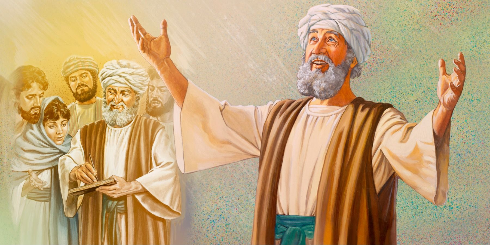

# 经文
<!-- _class: invert -->

---

57.	伊利莎白的产期到了，就生了一个儿子。
58.	邻里亲族听见主向她大施怜悯，就和她一同欢乐。
59.	到了第八日，他们来要给孩子行割礼，
    并要照他父亲的名字叫他撒迦利亚。
60.	他母亲说：“不可！要叫他约翰。”
61.	他们说：“你亲族中没有叫这名字的。”
62.	他们就向他父亲打手式，问他要叫这孩子什么名字。
63.	他要了一块写字的板，就写上，
    说：“他的名字是约翰。”他们便都希奇。
64.	撒迦利亚的口立时开了，舌头也舒展了，就说出话来，称颂　神。
65.	周围居住的人都惧怕；这一切的事就传遍了犹太的山地。
66.	凡听见的人都将这事放在心里，
    说：“这个孩子将来怎么样呢？因为有主与他同在。”

---

67.	他父亲撒迦利亚被圣灵充满了，就预言说：
68.	主──以色列的　神是应当称颂的！
    因他眷顾他的百姓，为他们施行救赎，
69.	在他仆人大卫家中，为我们兴起了拯救的角，
70.	正如主藉着从创世以来圣先知的口所说的话，
71.	拯救我们脱离仇敌和一切恨我们之人的手，
72.	向我们列祖施怜悯，记念他的圣约──
73.	就是他对我们祖宗亚伯拉罕所起的誓──
74.	叫我们既从仇敌手中被救出来，
75.	就可以终身在他面前，坦然无惧地用圣洁、公义事奉他。

---

76.	孩子啊！你要称为至高者的先知；
    因为你要行在主的前面，预备他的道路，
77.	叫他的百姓因罪得赦，就知道救恩。

78.	因我们　神怜悯的心肠，叫清晨的日光从高天临到我们，
79.	要照亮坐在黑暗中死荫里的人，把我们的脚引到平安的路上。

80.	那孩子渐渐长大，心灵强健，住在旷野，
    直到他显明在以色列人面前的日子。

---
# 施洗的约翰
<!-- _class: invert -->
---

## 圣经中的约翰

* 意思是“**上帝的恩典**”
* 使徒约翰
    * 约翰福音，启示录，短书
* 施洗者圣约翰
    * 给耶稣施洗
    * 劝人悔改
    * 洗去自己的罪
    * 主前面的先行者

<!--
名字贴切
- 神的恩典显在他身上
- 他也叫人看到神更大的救恩

先行者
- 人预备好自己
- 迎接耶稣到来

给耶稣解鞋带也不配

这两个约翰什么关系？

提问还有哪些约翰
- 　　三、称呼马可的约翰(徒十二章12节)，即写马可福音的马可。
- 　　四、大祭司的亲族约翰(徒四章6节)。
- 　　五、彼得的父亲约翰，又称为约拿(约二十一章15节；太十六章17节)。
-->
---

## 约翰的出生
* 是主的怜悯
    * > 58a 邻里亲族听见主向她大施怜悯
* 名字是主所赐的
* 从出生开始，所有人都知道他是先知

<!--
- 名字是主所赐的
    - 顺服神，不听从众人，

高调出道， 为的是给主开路
- 他必兴旺，我必衰微。 约 3：30
-->

---

## 约翰的职分

* > 17a 他必有以利亚的心志能力
    * 与以利亚同在的灵也与他同在
* > 76a 孩子啊！你要称为至高者的先知；
    * 传讲神的信息
    * > 路 7:28 我告诉你们、凡妇人所生的、没有一个大过约翰的。
    * > 然而　神国里最小的比他还大。”
* > 76b 因为你要行在主的前面，预备他的道路，
    * 责备以色列人，劝人悔改，施洗
    * 教导人
        * 救恩

<!--
给

以利亚的能力
- 和巴力的先知斗法
- 让人悔改归向神

最大先知
- 因为是行在主前
- 旧约先知都没有看到主，约翰看到了

神国里最小的
- 因为与神同在

-->
---

## 约翰的生活
> 80. 那孩子渐渐长大，心灵强健，住在旷野，
    直到他显明在以色列人面前的日子。
* 与世界分别
* 完全靠主供应
* 完全靠主带领

<!--
约翰的生活中充满神的恩典

在旷野
- 不与人交往
- 不沾染世俗
    - 不与祭司为伍

主供应
- 条件艰苦
    - 蝗虫野蜜

心灵强健
- 都没有说身体强健
- 有主亲自带领
-->

---
<!-- _class: invert -->
# 撒加利亚的祷告

---

## 祷告的内容

> 73 就是他对我们祖宗**亚伯拉罕**所起的誓
* > 创世记	35	:	11	　神又对他说：“我是全能的　神；你要生养众多，将来有一族和多国的民从你而生，又有君王从你而出。 （约公元前2166）

<!--
神把他的救恩显明给亚伯拉罕
君王虽然也指大卫
但更指耶稣
-->
---

## 祷告的内容
> 69 在他仆人**大卫**家中，为我们兴起了拯救的角
* > 撒母耳记下 7:12-13，"你寿数满足，与你列祖同睡的时候，我必使你的后裔接续你的位。我也必坚定他的国。他必为我的名建造殿宇。" （旧约，约公元前970年）

<!--
神把他的救恩显明给大卫
后裔虽然也指所罗门
但更指耶稣
-->

---
## 祷告的内容
> 70 正如主藉着从创世以来圣先知的口所说的话，
* > 以赛亚书 9:6-7 因有一婴孩为我们而生；有一子赐给我们。政权必担在他的肩头上；他名称为“奇妙策士、全能的　神、永在的父、和平的君”。 他的政权与平安必加增无穷。他必在大卫的宝座上治理他的国，以公平公义使国坚定稳固，从今直到永远。万军之耶和华的热心必成就这事。 （旧约。约公元前7世纪）

<!--
神把他的救恩显明给以赛亚
明明白白得预言耶稣
-->

---

## 祷告的内容
> 78b 叫清晨的日光从高天临到我们，
79	要照亮坐在黑暗中死荫里的人，把我们的脚引到平安的路上。
* 预言耶稣道成肉身

<!--
神把他的救恩显明给撒迦利亚
-->

---
## 约翰福音 1

1	太初有道，道与　神同在，道就是　神。
2	这道太初与　神同在。
3	万物是藉着他造的；凡被造的，没有一样不是藉着他造的。
4	生命在他里头，这生命就是人的光。
5	光照在黑暗里，黑暗却不接受光。
...

---

## 称颂主
* 只有两节是预言约翰的事工（76，77）, 其他全部都在颂赞
* 圣灵充满溢出来的是称颂

<!--
67.	他父亲撒迦利亚被圣灵充满了，就预言说：
68.	主──以色列的　神是应当称颂的！
    因他眷顾他的百姓，为他们施行救赎，
69.	在他仆人大卫家中，为我们兴起了拯救的角，

空间有限，不放了

## 我们在祷告什么
* 求
* 感谢
* 颂赞

乞求神帮助我们
感谢神帮助了我们
颂赞主的救恩
- 撒迦利亚还没有看见救恩就已经颂赞

求助帮我们更多认识主
叫我们有更大的信心
教导我们如何颂赞
-->

---

## 称颂的原因
* 眷顾，怜悯
* 拯救，救赎
* 仇敌
* > 77 叫他的百姓因罪得赦，就知道救恩
* > (新约) 以弗所书 6:12 因我们并不是与属血气的争战｛原文是摔跤；下同｝，乃是与那些执政的、掌权的、管辖这幽暗世界的，以及天空属灵气的恶魔争战。
* > 74	叫我们既从仇敌手中被救出来，
75	就可以终身在他面前，坦然无惧地用圣洁、公义事奉他。

<!--
仇敌
- 敌国，特别是拜偶像的敌国（菲利士人，罗马人）
- 其实是应当是魔鬼
    - 不是与属血气的相争 （去查）
- 不是脱离世俗的权势
    - 而是脱离罪的权势，
    - 脱离魔鬼的掌控，

- 而与神相交
    - 在天国里最小的，也是比地上最大的大
-->

---
## Take Home
# 神是施恩典的神

<!-- 
约翰 名字的意思
他身上有神的恩典

他传神的救恩
-->

---

## 讨论

* 你从约翰身上可以看到什么特质?
* 第一章里的人物，哪一个你最有共鸣
* 最近一段时间里，我们有什么可以感谢称颂主的？
* 你怎么认识神的信实？

<!--
尝试用 ‘神是恩典’ 串起信息
所有的引用都指向耶稣
尝试总结 take home

引用的经文，指明时间和先知的名字

总结出现过的人物
- 撒迦利亚
    - 怀疑到称颂
- 玛丽亚
    - 顺服
    - 反复思考
- 伊丽莎白
    - 
-->